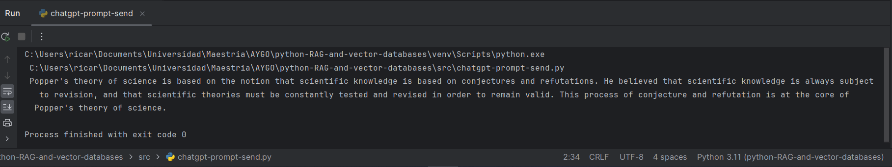
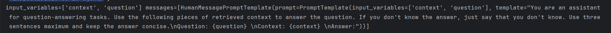
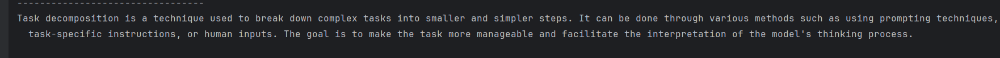

# PYTHON-RAG-AND-VECTOR-DATABASES

Este repositorio contiene varios programas escritos en Python que usan librerías y conexiones con modelos generativos de IA.

## Conceptos
- LLM - Los modelos de lenguaje de gran tamaño (Large Language Models) son modelos de aprendizaje profundo muy grandes que se preentrenan con grandes cantidades de datos.
- RAG - Generación aumentada de recuperación (Retrieval-augmented generation) Es una técnica para mejorar la precisión y fiabilidad de los modelos generativos de IA con datos obtenidos de fuentes externas.
- Base de datos vectorial - Una base de datos vectorial es un tipo de base de datos que almacena datos como vectores de alta dimensión, que son representaciones matemáticas de características o atributos. Cada vector tiene un número determinado de dimensiones, que puede oscilar entre decenas y miles, dependiendo de la complejidad y granularidad de los datos.
    Por ejemplo, puede utilizar una base de datos vectorial para:

    - Encontrar imágenes similares a una imagen dada en función de su contenido visual y su estilo
    - Encontrar documentos similares a un documento en función de su tema y sentimiento
    - Encontrar productos similares a un producto determinado en función de sus características y valoraciones

- [LangChain](https://python.langchain.com/docs/get_started/introduction) es un framework diseñado para desarrollar aplicaciones basadas en modelos de lenguaje LLM como CHATGPT.

    Permité que las aplicaciones puedan trabajar con documentos e información externa y combinarlo con estos modelos.


## Requisitos

- Python 3.8 a 3.11
- PIP, el manejador de paquetes de python.
- Librerías de python: [lista de Librerías requeridas](./requirements.txt)
- Acceso al API de openai
- Una cuenta y un ambiente creados en [PINECONE](https://www.pinecone.io)


## 1. CHATGPT PROMPT SEND

Este [programa](src/chatgpt-prompt-send.py) es un ejemplo de cómo utilizar langchain para generar respuestas a preguntas generando un prompt y utilizando modelos de lenguaje de OpenAI.


## 2. RAG WITH MEMORY VECTOR DATABASE
Este [programa](src/RAG-with-memory-vector-db.py) utiliza las librerías bs4 para obtener los datos de una página html y langchain para:
1. Cargar los datos de una página usando el módulo DocumentLoaders.
2. Partir los documentos obtenidos de la página en fragmentos más pequeños ya que el documento cargado tiene más de 42 mil carácteres, es demasiado largo para que quepa en la ventana de contexto de muchos modelos. E incluso si fuera un módelo que soportara textos largos para los modelos suele ser dificil encontrar algún contenido relevante en mensajes muy largos.
3. Guardar los fragmentos de texto en una base de datos vectorial local usando VectorStore y OpenAIEmbeddings.
4. Según un input, recuperar los fragmentos relevantes guardados en la base de datos vectorial.
5. En esta linea usa una interfaz para traer un prompt del hub de langchain para enviarselo al modelo y que genere una respuesta más limpia a la pregunta que se envíe.
    ```python
    prompt = hub.pull("rlm/rag-prompt")
    ```

    

6. Usando un modelo gpt-3.5-turbo se genera una respuesta a una pregunta usando el prompt que incluye la pregunta y los fragmentos recuperados dentro del contexto.



## 3. RAG USING PINECONE

Este [programa](src/RAG-using-pinecone.py) necesita en las variables de entorno una API key para acceder a los recursos de una cuenta en pinecone, que es una base de datos vectorial en la nube, el nombre de un ambiente creado en pinecone y los módulos de langchain para:

En la función loadText():
1. Leer un [archivo de texto](./animation.txt) usando TextLoader de langchain.
2. Partirlo en fragmentos usando RecursiveCharacterTextSplitter de langchain.
3. Crear un indice si no existe en el ambiente de pinecone.
4. Y con esta línea cargar los fragmentos de texto en la base de datos vectorial
    ```python
    docsearch = Pinecone.from_documents(docs, embeddings, index_name=index_name)
    ```
En la función search()

1. Acceder a los recursos de Pinecone usando el ambiente y la llave API.
2. Cargar los documentos del indice `langchain-demo`
3. Enviar una pregunta y obtener los fragmentos de texto guardados en la base de datos vectorial que concuerden mejor con la pregunta.

## Uso

1. Clona este repositorio en tu máquina local.
2. Instala las bibliotecas requeridas ejecutando el siguiente comando en tu terminal:

    ```bash
    pip install -r requirements.txt
    ```

3. Ejecuta los programas utilizando el intérprete de Python. Por ejemplo:

    ```bash
    python programa1.py
    ```

## Contribuciones

Si deseas contribuir a este proyecto, puedes enviar un pull request con tus cambios. Asegúrate de seguir las mejores prácticas de codificación y documentación.

## Licencia

Este proyecto está bajo la Licencia [MIT]. Consulta el archivo [LICENSE](./LICENSE) para obtener más información.
